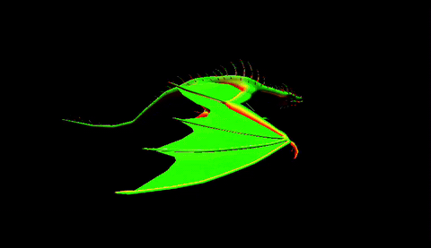

### Vulkan Renderer

A real-time renderer built in C++ and Vulkan, for learning modern graphics 
programming concepts.

#### Features
- glTF model loading
- Skeletal animation playback (single animation, linear interpolation)
- Blinn-Phong shading

#### Roadmap
- PBR
- Multiple animation support

### Images

